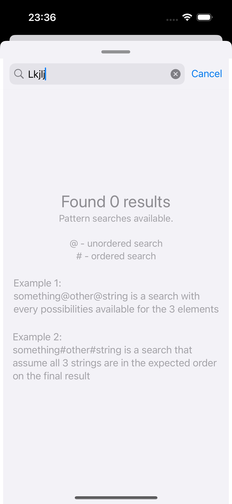
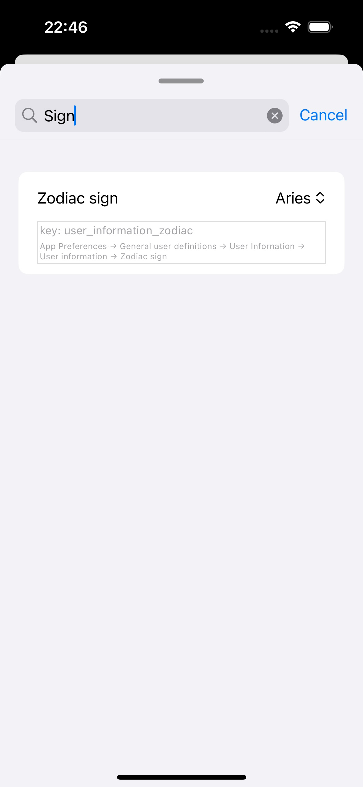

# AppSettings

Welcome to **AppSettings**, the ultimate Swift library designed to simplify the process of integrating customisable app settings directly into your iOS application. With AppSettings, you can create and manage settings screens within your app with ease, providing a seamless and intuitive experience for both developers and users.

AppSettings also allow to be initialised by other sort of files compliant with iOS [Settings Application Schema Reference](https://developer.apple.com/library/archive/documentation/PreferenceSettings/Conceptual/SettingsApplicationSchemaReference/Introduction/Introduction.html).

All Specifiers models are Codable leaving also open, in future, the possibility of injecting the entries via JSON.

<p align="center">
    
    
    
</p>

## Requirements

* iOS Version: Requires iOS 15.0 or later
* Swift Version: Compatible with Swift 5.10 and above
* Swift Package Manager: AppSettings is available exclusively through Swift Package Manager, ensuring easy integration and management of dependencies.

## Key Features

* launch makes use of async/await swift feature, under the hood, making it safe to be launched in any place that is more convinent to the app
* Setting search: AppSettings does provide an intuitive and easy to use search that will allow to get any content from our Settings without needing to remember the exact path.
* Searching types: by exact string, unordered search, ordered search
* Customisable Settings: Easily change settings from your app without need to jump between Settings.app and your app.
* Start using AppSettings without needing extensive boilerplate code to make it work.
* User-Friendly Interface: The UI/UX is the nearest possible to the one already known from settings app, only MultiValue and Radio buttons use specific UI (not the same as used in Apple's official Settings.app).
* Swift Integration: Leverage the power of Swift to build and manage your settings with clean, type-safe code.
* Built with SwiftUI: Take advantage of SwiftUI. Every specifier is built with SwiftUI making use of a MVVM like approach.
* Accessible Identifiers: Every rendered specifier has its own Accessible Identifier making easier to change configurations while UI tests are happening, and allowing UI tests to automate better longer and more performant unit tests

## Installation

To integrate AppSettings into your Xcode project, follow the steps:

* Open your project in Xcode.
* Navigate to File > Swift Packages > Add Package Dependency.
* Enter the AppSettings repository URL: https://github.com/nasrs/appsettings
Select the version you want to use.
* Add AppSettings to your target.

## Getting Started

Here’s a quick example to get you started with AppSettings:

## Getting started

Because of the inter compatibility between Swift and UIKit (and vice-versa) is possible to render AppSettings on SwiftUI or UIKit apps. 

### SwiftUI
```swift
import AppSettings
import SwiftUI

@main
struct SampleSettingsSwiftUIApp: App {
     @State var showSheet: Bool = false
     
     init() {
         // AppSettings object initialiser. This object will be responsible to start `AppSettings` singleton and configure all valid entries.
        SettingsBundleReader.setup()
     }
     
     var body: some Scene {
         WindowGroup {
             ContentView()
                 .onTapGesture(count: 3) {
                     showSheet.toggle()
                 }
                 .sheet(isPresented: $showSheet, content: {
                     SettingsRendererView.build()
                 })
         }
     }
}
```

### UIKit

```swift
import AppSettings
import UIKit

@main
class AppDelegate: UIResponder, UIApplicationDelegate {
    func application(_ application: UIApplication, didFinishLaunchingWithOptions launchOptions: [UIApplication.LaunchOptionsKey: Any]?) -> Bool {
        SettingsBundleReader.setup()
        return true
    }
    ...
}

...

class ViewController: UIViewController {
    ...
    @IBAction func didPressButton(_ sender: Any) {
        present(
            UIHostingController(rootView: SettingsRendererView.build(),
                                animated: true)
        )
    }
    ...
}

```

### AppSettings search

| Search with no results (default empty screen) | Search with results |
|-|-|
|  |  |

### Sample Project and Tests

#### Sample
Actually working on a sample project that demonstrates the full capabilities of AppSettings. This sample project will showcase various customization options and best practices for integrating settings into your app. Once finished, the sample project will be available in the repository to help you get started quickly and effectively.

#### Unit Tests

Most of the objects and features are covered above 70%, but not all, so the main objective is to continue increasing the tool unit tests, in order to ensure its good functioning and reliability.

## Contributing

Contributions to enhance AppSettings are welcome! If you have suggestions, contributions, improvements or bugs found please make let us know.
Visit us [GitHub repository](https://github.com/nasrs/AppSettings.git).

- [pull requests](https://github.com/nasrs/AppSettings/pulls)
- [bug reports](https://github.com/nasrs/AppSettings/issues)

## License

AppSettings is released under the [MIT License](https://github.com/nasrs/AppSettings/blob/develop/LICENSE). See the LICENSE file for more details.

##

AppSettings is here to streamline your app development process, making it easier than ever to implement and manage custom settings within your iOS apps. Start using AppSettings today and improve your speed and make better and faster UI tests!